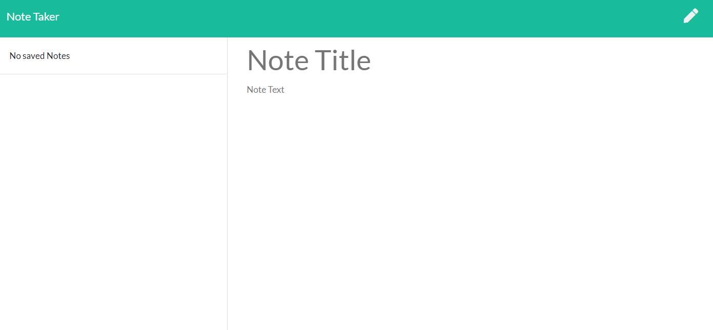

# Note Taker Application
  

## Description
This simple note taking application allows the user to write, save and delete notes to help organize thoughts and keep track of tasks to be completed.

## Deployment

[Note Taker](https://)


## Table of Contents

* [Installation](#installation)
* [Technology Used](#technology-used)
* [Usage](#usage)
* [Screenshots](#screenshots)
* [MVP - Minimum Viable Product](#mvp-minimum-viable-product)
  * [User Story](#user-story)
  * [Acceptance Criteria](#acceptance-criteria)
* [Questions](#questions)
* [Badges](#badges)
* [Authors](#author)
* [Contributing](#contributing)

## Installation
To install, please run the following command in terminal:
  
```
npm i
```

## Technology Used
<details>
    <summary markdown="span">Click to expand Project Technology Details</summary>

Languages
- HTML5
- CSS3
- Javascript

Libraries
- [jQuery](jquery.com)

CSS Framework
- [Bootstrap](getbootstrap.com)

Web Framework
- [Express.js](expressjs.com)


</details>

## Usage
This is a very simplistic note taking application. It will start on the homepage, so just click on the "Get Started" button to enter the application. 

The title of any previously saved notes will be visible on the left side of the screen. Enter the title of the note and the body of note before clicking the saved button which looks like a disk. Clicking on a saved note will display the note body in the viewing window. To create a new note, click on the edit pencil. To delete a saved note, click on that note's trash can icon. Click on the Note Taker header in the menu bar to return to the homepage at any time.

## Screenshots


*Home Page of Note Taker Application*




*Initial note entry page*


*View of previously saved note title and body*

## MVP - Minimum Viable Product

<details>
    <summary markdown="span">Click to expand Assignment Instruction Details</summary>

  ### User Story

    ```
    AS A user, I want to be able to write and save notes
    I WANT to be able to delete notes I've written before
    SO THAT I can organize my thoughts and keep track of tasks I need to complete
    ```

  ### Acceptance Criteria

    ```
    GIVEN I have entered information for a new note
    WHEN I click on the save button
    THEN I see the saved note in the task list

    GIVEN I have a saved note
    WHEN I have clicked the trash can icon
    THEN I can delete the saved note from the task list

    GIVEN I have closed the application
    WHEN I reopen the application
    THEN I will see my previously saved notes
    ```
</details>
----

## Questions
If you have any questions about the repo, open an issue or contact [Hlsorrells](github.com/Hlsorrells) directly at [hlsorrells.dev@gmail.com](mailto:hlsorrells.dev@gmail.com).

## Badges

  


## Author

[Heather Sorrells](mailto:hlsorrells.dev@gmail.com)

## Contributing
Go to GitHub repo and create a pull request or email the developer directly. See [Questions](#questions).

